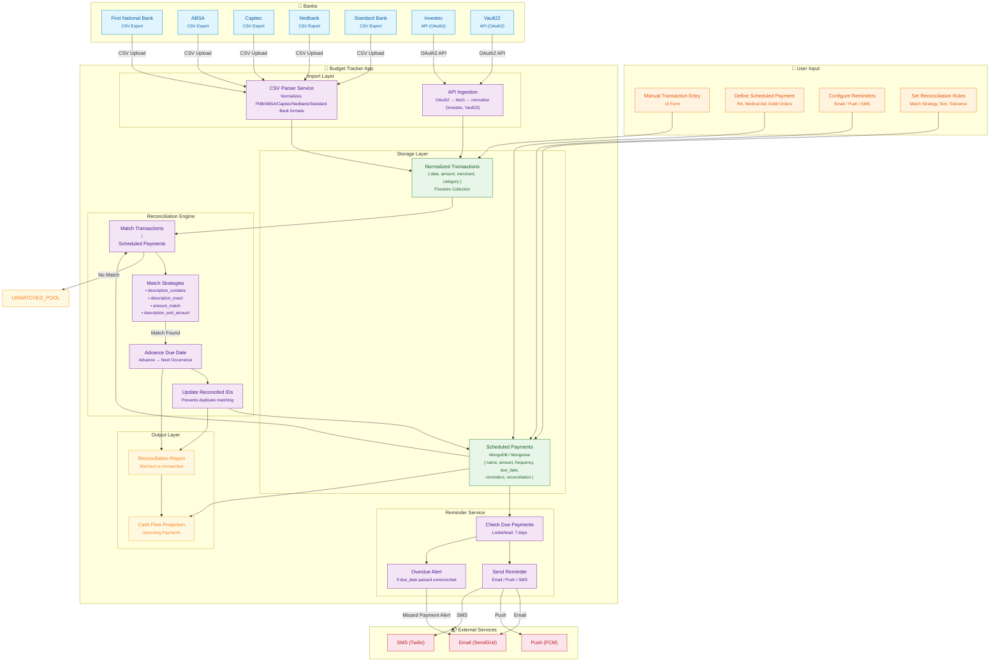
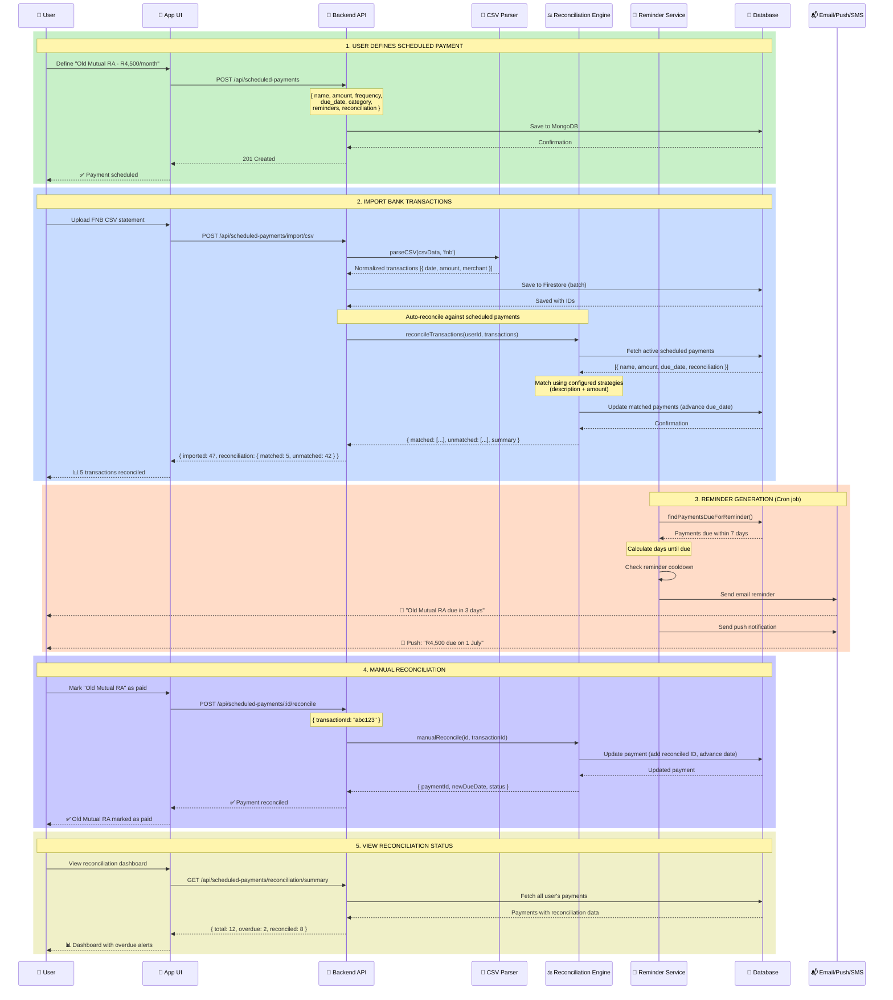
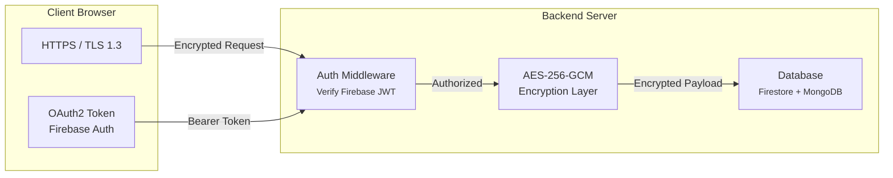

# Data Flow: Bank → App → Reminders → Reconciliation

This document describes the complete data flow for the South African Budget Tracker's scheduled payments feature.

## High-Level Flow Diagram

## Sequence Diagram: End-to-End Flow

## Security Flow (POPIA & AES-256)

## Architecture Summary

| Layer | Technology | Purpose |
|-------|-----------|---------|
| **Frontend** | React + TypeScript | UI for managing payments, importing CSVs, viewing reconciliation |
| **API** | Express.js | REST endpoints for CRUD, CSV import, reconciliation, reminders |
| **Database** | Firestore (transactions) + MongoDB (scheduled payments) | Persistent storage with proper indexing |
| **CSV Parsing** | Custom service | Normalizes FNB, ABSA, Capitec, Nedbank, Standard Bank formats |
| **Reconciliation** | Custom engine | Matches bank txns → scheduled payments via configurable strategies |
| **Reminders** | Custom service | Email (SendGrid), Push (FCM), SMS (Twilio) integration |
| **Security** | Firebase Auth + TLS + AES-256 | POPIA-compliant data protection |